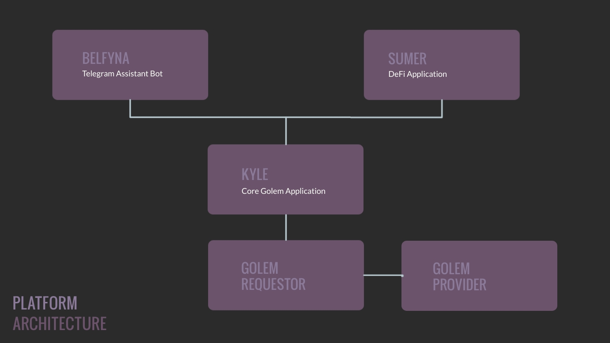

# MAGIC-DOLL

Magic-doll is a multi-application platform that build on top of [Kyle](https://github.com/bakaoh/magic-doll/tree/master/kyle), a Golem application

## Document

- [Presentation](https://github.com/bakaoh/magic-doll/blob/master/presentation/README.md)

## Video Demo

- Belfyna: https://youtu.be/H__CzO2PMg8

- Sumer: https://youtu.be/1ObEzplTFTY

 
## Architecture

- [Kyle](https://github.com/bakaoh/magic-doll/tree/master/kyle) (the core). Golem image hash: `22c45201c7b40d8719bd8da3fae74cf9839bf3ea0770ce5fda846eaf`
- [Belfyna](https://github.com/bakaoh/magic-doll/tree/master/belfyna) (the assistant bot). `@belfyna_bot` on telegram
- [Sumer](https://github.com/bakaoh/magic-doll/tree/master/sumer) (GameDeFi product). [Link](https://idlesplinter.xyz/sumer)
- (Coming soon) - Kyle market
- (Coming soon) - Fit The Match market

## Misc

A golem created by the twisted witch Sumer. However, instead of being animated by magic, it has been brought to life using human souls (or GLM).

## License
`Magic-doll` is licensed under the terms of the GNU General Public License Version 3. See [LICENSE.md](LICENSE.md) for more information.