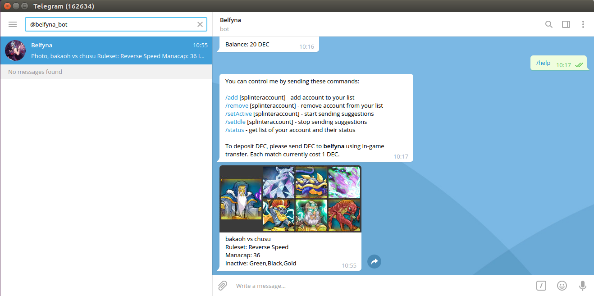

# BELFYNA

Belfyna is a [telegram](https://telegram.org/) bot that help user communicate with [Kyle](https://github.com/bakaoh/magic-doll/tree/master/kyle). Whenever user got a match, Belfyna will ask Kyle for the best team to play and show it to user.



## Prerequisites

- [Node](https://nodejs.org/en/)
- [Yarn](https://classic.yarnpkg.com/en/docs/install/)
- Yagna requestor [app key](https://handbook.golem.network/requestor-tutorials/flash-tutorial-of-requestor-development#generate-the-app-key)
- Telegram bot [token](https://core.telegram.org/bots/api#authorizing-your-bot)

## Usage

Install `yarn` dependencies

```
$ cd belfyna/
$ yarn
```

Add environment variable 

```
export YAGNA_APPKEY=your_yagna_app_key_here
export TELEGRAM_TOKEN=your_telegram_bot_token_here
```

Run the service

```
$ node src/service.js
```

Or start and monitor with [pm2](https://www.npmjs.com/package/pm2)

```
$ pm2 start ecosystem.config.js --only belfyna
```

## Misc

**LADY OF THE MEGIDDO / BELFYNA** - A noblewoman who works for the one who has been scheming behind the scenes in the Duchy of Crest, Annarose. She has the title of Lady Belfyna, and often appears at social events. However, her true duty is to lead suppression troops made up of Magic Dolls.